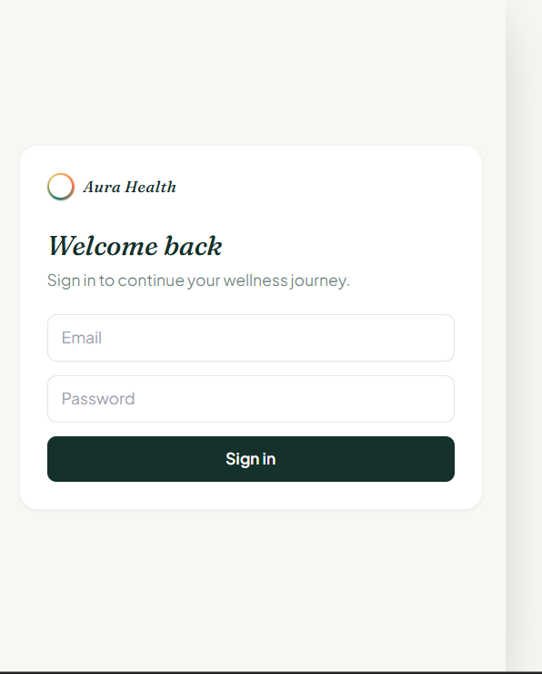
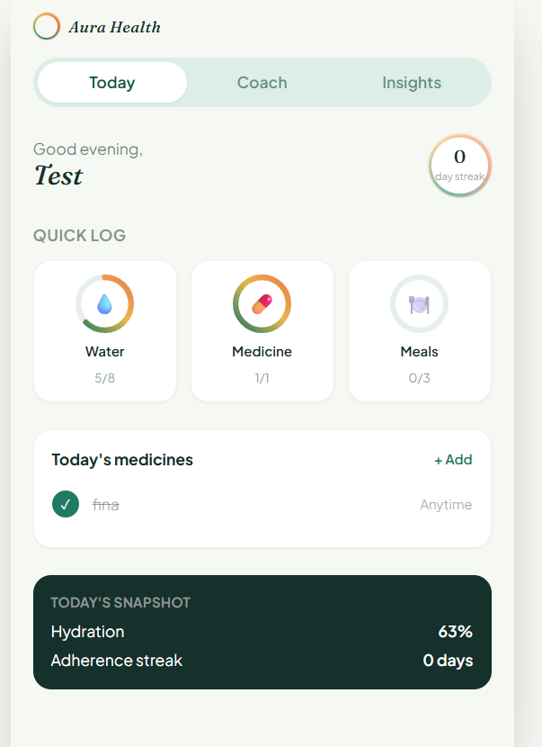
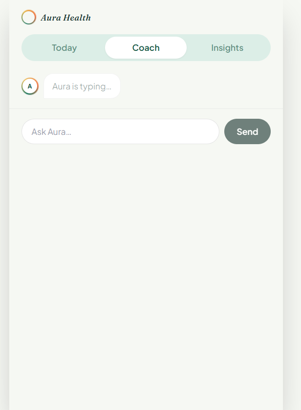
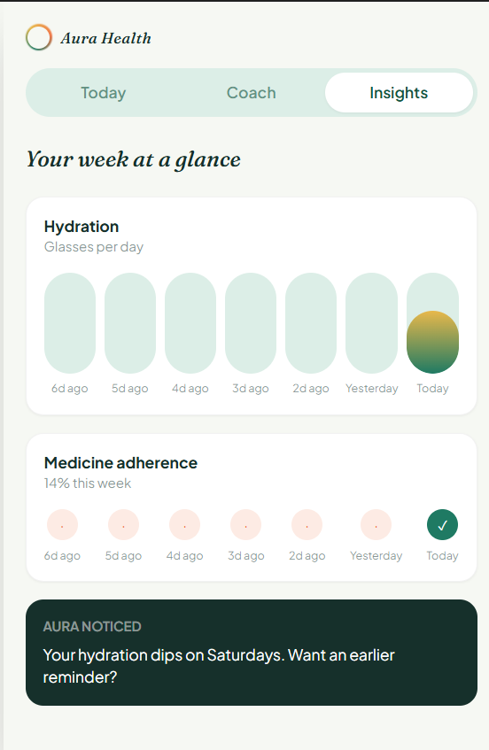

# 🌿 Aura Health – AI-Powered Wellness Companion

<p align="center">


</p>

---

# 🌟 Overview

Aura Health is an **AI-powered wellness companion** built using the **MERN Stack** and **Google Gemini AI**.

The application helps users develop healthy habits by tracking hydration, managing medications, monitoring wellness progress, and interacting with an intelligent AI health coach.

Aura Health also introduces **Care Circle**, allowing trusted family members or caregivers to receive wellness updates and emergency alerts, making healthcare more connected and supportive.

Developed as part of the **IIT Jammu Hackathon**, Aura Health combines **AI, health tracking, and digital caregiving** into one seamless platform.

---

# 🏆 Hackathon Highlights

✅ AI Wellness Coach powered by Google Gemini

✅ JWT Authentication

✅ Water Intake Tracking

✅ Medicine Reminder System

✅ Personalized Health Dashboard

✅ Care Circle for Trusted Contacts

✅ Emergency Detection & Escalation

✅ Notification Simulation

✅ Responsive Mobile-first UI

✅ MERN Stack Architecture

✅ Cloud Deployment (Vercel + Render)

---

# 🚀 Live Demo

## Frontend

[[live]([https://aura-health-f1hu0n0jj-akshay-anands-projects-cf891d53.vercel.app/](https://aura-health-nine.vercel.app/))](https://aura-health-nine.vercel.app/)

demo account
akshay.anand_cs24@gla.ac.in

password-123456

## Backend API

https://aura-health-bpz8.onrender.com

---

# ✨ Features

---

## 🔐 User Authentication

- Secure JWT Authentication
- User Registration
- User Login
- Protected Routes
- Persistent Login Sessions

---

## 💧 Water Tracking

- Log daily water intake
- Daily hydration goal
- Water history
- Hydration progress
- Daily hydration insights

---

## 💊 Medicine Management

- Add medicines
- Edit medicines
- Delete medicines
- Active/Inactive medicines
- Reminder schedules
- Daily medicine overview

---

## ✅ Medicine Logs

- Mark medicines as taken
- View today's medicine logs
- Medicine adherence tracking
- History tracking

---

## 📊 Health Dashboard

Provides a complete daily health summary including:

- Water intake
- Medicine adherence
- Daily progress
- Health insights
- Wellness statistics

---

# 🤖 Aura AI Coach

Powered by **Google Gemini AI**

Aura acts as an intelligent wellness companion rather than simply answering questions.

### Features

- Personalized health coaching
- Hydration guidance
- Medication guidance
- Daily wellness summaries
- Healthy habit recommendations
- Motivational conversations
- Context-aware responses
- Markdown formatted replies
- Friendly conversational interface

The AI understands:

- User profile
- Water intake
- Active medicines
- Medicine logs
- Daily progress

to generate personalized coaching responses.

---

# 🚨 Emergency Detection

Aura AI can detect emergency situations during conversations.

Examples include:

- Chest pain
- Difficulty breathing
- Stroke symptoms
- Severe bleeding
- Suicidal thoughts

When detected:

- Displays emergency warning
- Advises contacting emergency services
- Triggers Care Circle alert simulation

---

# 👨‍👩‍👧 Care Circle

Care Circle allows users to connect trusted contacts.

### Features

- Add trusted contacts
- Edit contacts
- Delete contacts
- Relationship categories

Examples:

- Parent
- Partner
- Spouse
- Family Member
- Caregiver

Each contact can independently receive:

- Missed medicine reminders
- Daily completion notifications
- Weekly summaries
- Emergency alerts

---

# 🔔 Notification Simulation

Aura includes a complete notification simulator for demonstration purposes.

Supported simulations:

- Missed medicine reminder
- Reminder escalation
- Care Circle notifications
- Email simulation
- SMS simulation
- Emergency notification logs

Perfect for hackathon demonstrations.

---

# 🤖 AI Safety

Aura Health is a **wellness assistant**, not a medical professional.

Aura AI:

- Encourages healthy habits
- Promotes hydration
- Encourages medicine adherence
- Motivates users
- Provides wellness suggestions

Aura AI **does NOT**:

- Diagnose diseases
- Prescribe medication
- Recommend dosages
- Replace professional medical advice

---

# 🛠 Tech Stack

## Frontend

- React
- Vite
- Tailwind CSS
- Axios
- Context API
- React Hooks

---

## Backend

- Node.js
- Express.js
- MongoDB Atlas
- Mongoose
- JWT Authentication
- bcryptjs

---

## AI

- Google Gemini API
- @google/genai SDK

---

## Database

MongoDB Atlas

Collections include:

- Users
- Medicines
- Medicine Logs
- Water Logs
- Care Circle Contacts
- Notification Logs

---

# 📁 Project Structure

```text
Aura-Health

├── frontend
│   ├── public
│   ├── src
│   │
│   ├── components
│   ├── constants
│   ├── context
│   ├── hooks
│   ├── layouts
│   ├── pages
│   ├── services
│   ├── utils
│   ├── App.jsx
│   └── main.jsx
│
└── backend
    ├── config
    ├── controllers
    ├── middleware
    ├── models
    ├── routes
    ├── services
    ├── utils
    ├── server.js
```

---

# 🚀 Installation

## Clone Repository

```bash
git clone https://github.com/codedreammer/aura-health.git

cd aura-health
```

---

## Install Frontend

```bash
cd frontend

npm install
```

---

## Install Backend

```bash
cd ../backend

npm install
```

---

# ⚙ Environment Variables

Backend

```env
PORT=5000

MONGO_URI=your_mongodb_connection_string

JWT_SECRET=your_jwt_secret

GEMINI_API_KEY=your_google_gemini_api_key

GEMINI_MODEL=gemini-3.6-flash

CLIENT_URL=http://localhost:5173
```

Frontend

```env
VITE_API_BASE_URL=http://localhost:5000/api
```

---

# ▶ Running the Project

## Backend

```bash
cd backend

npm run dev
```

or

```bash
node server.js
```

---

## Frontend

```bash
cd frontend

npm run dev
```

---

# 🌐 Deployment

## Frontend

- Vercel

## Backend

- Render

---

# 🔗 API Endpoints

## Authentication

| Method | Endpoint |
|----------|-----------|
| POST | /api/auth/register |
| POST | /api/auth/login |

---

## Users

| Method | Endpoint |
|----------|-----------|
| GET | /api/users/profile |
| PUT | /api/users/profile |

---

## Water

| Method | Endpoint |
|----------|-----------|
| GET | /api/water/today |
| GET | /api/water/history |
| POST | /api/water |
| DELETE | /api/water/:id |

---

## Medicines

| Method | Endpoint |
|----------|-----------|
| GET | /api/medicines |
| POST | /api/medicines |
| PUT | /api/medicines/:id |
| DELETE | /api/medicines/:id |

---

## Medicine Logs

| Method | Endpoint |
|----------|-----------|
| GET | /api/medicine-logs/today |
| GET | /api/medicine-logs/history |
| POST | /api/medicine-logs |
| PUT | /api/medicine-logs/:id |

---

## AI Coach

| Method | Endpoint |
|----------|-----------|
| POST | /api/ai/chat |

---

## Care Circle

| Method | Endpoint |
|----------|-----------|
| GET | /api/care-circle |
| POST | /api/care-circle |
| PUT | /api/care-circle/:id |
| DELETE | /api/care-circle/:id |
| GET | /api/care-circle/logs |
| DELETE | /api/care-circle/logs |
| POST | /api/care-circle/simulate |

---

# 📸 Screenshots






# 📈 Future Enhancements

- Push Notifications
- Twilio SMS Integration
- Email Integration
- Firebase Cloud Messaging
- Voice-enabled AI Coach
- Wearable Device Integration
- AI Weekly Wellness Reports
- Smart Health Score
- PDF Health Reports
- Calendar Integration
- Multi-language Support

---

# 👨‍💻 Team

Developed as part of the **IIT Jammu Hackathon**.

Akshay Anand

Abhishek Kumar

Abhishek Yadav

---

# 📄 License

This project is licensed under the MIT License.

---

# ⭐ Support

If you found this project useful:

⭐ Star the repository

🍴 Fork the project

💬 Share your feedback

---

# ❤️ Acknowledgements

- Google Gemini AI
- MongoDB Atlas
- React
- Node.js
- Express.js
- Tailwind CSS
- Vite
- Render
- Vercel

---

# 🌿 Aura Health

> **"Track Better. Live Healthier. Stay Connected. Powered by AI."**
